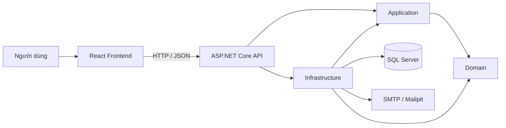
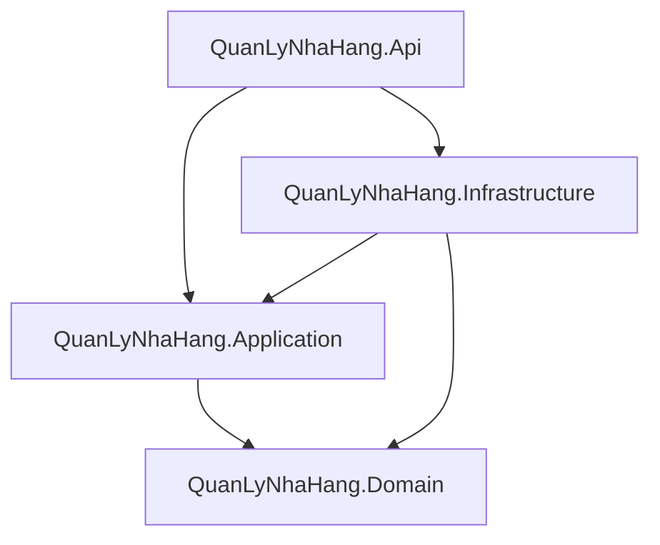
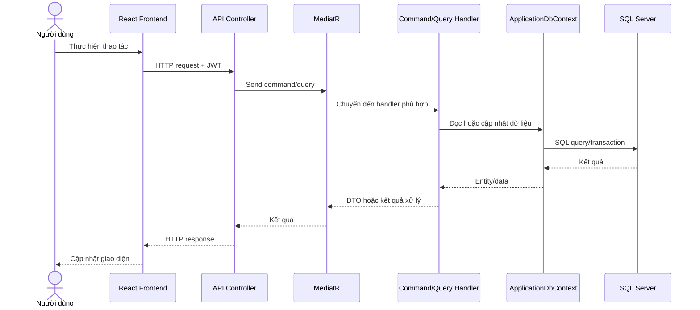
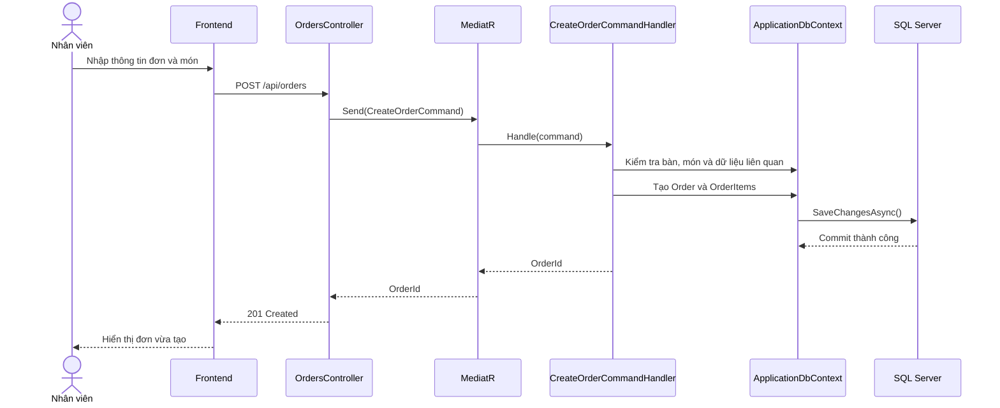
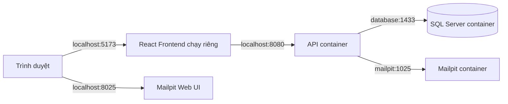

# Kiến trúc hệ thống Quản Lý Nhà Hàng

Tài liệu này mô tả kiến trúc hiện tại của repository `QuanLyNhaHang`, cách các thành phần phụ thuộc lẫn nhau, cách hệ thống được triển khai và một số luồng nghiệp vụ tiêu biểu. Nội dung được trình bày theo các khái niệm của Chương 6 – Architectural Design.

## 1. Tổng quan

Hệ thống hiện được tổ chức theo mô hình **modular monolith** kết hợp:

- Clean Architecture;
- Layered Architecture;
- CQRS;
- MediatR;
- REST API;
- React SPA;
- Entity Framework Core và SQL Server.

Frontend và backend tách rời, giao tiếp qua HTTP/JSON. Backend được triển khai dưới dạng một API duy nhất và sử dụng một cơ sở dữ liệu SQL Server dùng chung.



## 2. Các tầng kiến trúc

### 2.1 QuanLyNhaHang.Domain

Chứa các khái niệm nghiệp vụ cốt lõi:

- entity;
- trạng thái nghiệp vụ;
- quan hệ giữa các đối tượng trong hệ thống nhà hàng.

Đây là tầng trung tâm và không phụ thuộc vào API hoặc Infrastructure.

### 2.2 QuanLyNhaHang.Application

Chứa các use case của hệ thống:

- Commands cho thao tác thay đổi dữ liệu;
- Queries cho thao tác đọc dữ liệu;
- Handlers xử lý nghiệp vụ;
- DTOs;
- interfaces dùng để đảo chiều phụ thuộc;
- authorization rules và các quy tắc dùng chung.

Application phụ thuộc vào Domain. MediatR được sử dụng để tách controller khỏi handler và triển khai CQRS.

### 2.3 QuanLyNhaHang.Infrastructure

Cung cấp các triển khai kỹ thuật cho Application:

- `ApplicationDbContext`;
- Entity Framework Core và SQL Server;
- JWT và quản lý phiên đăng nhập;
- email/SMTP;
- activity log;
- permission service;
- các dependency registration.

Infrastructure phụ thuộc vào Application và Domain.

### 2.4 QuanLyNhaHang.Api

Là tầng giao tiếp HTTP và composition root:

- Controllers;
- authentication và authorization;
- permission policies;
- rate limiting;
- CORS;
- middleware xử lý lỗi;
- health check;
- OpenAPI;
- đăng ký Application và Infrastructure vào dependency injection.

Controller chỉ nhận request, kiểm tra dữ liệu ở mức HTTP, gửi command/query qua MediatR và trả response.

### 2.5 QuanLyNhaHang.Frontend

Là React SPA dành cho người dùng quản trị và vận hành nhà hàng. Frontend:

- hiển thị giao diện;
- quản lý trạng thái phía client;
- gửi request đến REST API;
- đính kèm access token;
- xử lý response và lỗi từ backend.

## 3. Quy tắc phụ thuộc



Quy tắc chính:

1. Domain không phụ thuộc vào tầng ngoài.
2. Application chỉ phụ thuộc vào Domain và abstraction cần thiết.
3. Infrastructure triển khai abstraction do Application định nghĩa.
4. API chịu trách nhiệm lắp ghép toàn bộ dependency.
5. Frontend không truy cập trực tiếp database.

> Lưu ý: `IApplicationDbContext` hiện sử dụng `DbSet<T>`, vì vậy Application vẫn biết một phần về Entity Framework Core. Đây là một đánh đổi thực tế của kiến trúc hiện tại.

## 4. Góc nhìn phát triển

```text
QuanLyNhaHang.Api
QuanLyNhaHang.Application
QuanLyNhaHang.Domain
QuanLyNhaHang.Infrastructure
QuanLyNhaHang.Frontend
QuanLyNhaHang.UnitTests
QuanLyNhaHang.IntegrationTests
```

Các feature backend được tổ chức theo nhóm nghiệp vụ, ví dụ:

```text
Features/Orders/
├── Commands/
│   ├── Create/
│   ├── Update/
│   ├── Delete/
│   ├── ChangeStatus/
│   └── AddOrderItem/
└── Queries/
    ├── GetList/
    ├── GetById/
    └── GetWithPaginatedList/
```

Cách tổ chức này giúp mỗi use case có phạm vi rõ ràng, dễ kiểm thử và dễ thay đổi độc lập.

## 5. Luồng xử lý request



## 6. Kịch bản tạo đơn hàng



Các quyền truy cập được kiểm tra tại API bằng JWT, `[Authorize]` và permission policy trước khi use case được thực thi.

## 7. Góc nhìn triển khai

### 7.1 Chạy bằng Docker Compose



Các service hiện có trong Docker Compose:

- `api`;
- `database`;
- `mailpit`.

Frontend chưa nằm trong Docker Compose và thường chạy riêng bằng Vite.

### 7.2 Chạy bằng Visual Studio

```text
React Frontend  --> localhost:<api-port>
Visual Studio API --> localhost,1433 --> SQL Server Docker
Visual Studio API --> localhost:1025 --> Mailpit Docker
SSMS              --> localhost,1433 --> SQL Server Docker
```

## 8. Các architectural pattern đang áp dụng

### Layered Architecture

Thể hiện qua việc chia hệ thống thành Presentation, Application, Domain và Infrastructure.

### Client–Server

React là client; ASP.NET Core API là application server; SQL Server là database server; Mailpit/SMTP là email server.

### Repository Architecture

Dữ liệu nghiệp vụ được lưu tập trung trong SQL Server và truy cập qua `ApplicationDbContext`. Dự án không sử dụng Generic Repository riêng cho từng entity.

### MVC

Hệ thống chỉ tương đồng một phần với MVC:

- View: React;
- Controller: ASP.NET Core API Controller;
- Model: Domain entities và DTOs.

Kiến trúc chính xác hơn là React SPA + REST API + CQRS, không phải server-rendered MVC.

### Middleware pipeline

ASP.NET Core xử lý request theo pipeline:

```text
Exception handling
→ Routing
→ CORS
→ Rate limiting
→ Authentication
→ Authorization
→ Controller
```

Đây là request pipeline, không phải Pipe and Filter architecture cho toàn hệ thống.

## 9. Thuộc tính chất lượng

### Bảo trì

- Phân tách feature theo command/query.
- Controller mỏng.
- Dependency được quản lý qua abstraction và dependency injection.

### Bảo mật

- JWT authentication.
- Kiểm tra phiên đăng nhập còn hiệu lực.
- Role và permission authorization.
- Rate limiting cho các endpoint nhạy cảm.
- Không lưu secret trong repository.

### Khả năng kiểm thử

- Unit test cho logic độc lập.
- Integration test cho API và database behavior.
- Handler có thể được kiểm thử riêng khỏi controller.

### Khả năng triển khai

- Docker Compose cung cấp môi trường API, SQL Server và Mailpit nhất quán.
- Health check giúp xác định trạng thái API và database.

## 10. Giới hạn hiện tại

- Đây là modular monolith, chưa phải microservices.
- Frontend chưa được đóng gói trong Docker Compose.
- Application còn phụ thuộc vào kiểu dữ liệu của Entity Framework Core thông qua `DbSet<T>`.
- Chưa có event bus hoặc message broker.
- Các module dùng chung một database và một deployment unit cho backend.

Các điểm này không phải lỗi; chúng là quyết định phù hợp với quy mô hiện tại và giúp hệ thống đơn giản hơn khi phát triển, kiểm thử và triển khai.

## 11. Nguyên tắc khi bổ sung chức năng mới

1. Entity và quy tắc cốt lõi đặt trong Domain.
2. Use case mới đặt trong `Application/Features/<Feature>/Commands` hoặc `Queries`.
3. Không viết nghiệp vụ trực tiếp trong controller.
4. Truy cập database thông qua abstraction của Application.
5. Implementation kỹ thuật đặt trong Infrastructure.
6. Endpoint phải có authentication/permission phù hợp.
7. Bổ sung unit test hoặc integration test cho hành vi quan trọng.
8. Không commit secret, mật khẩu, token hoặc connection string thật.
9. Cập nhật tài liệu này khi thay đổi dependency, deployment hoặc luồng xử lý chính.
